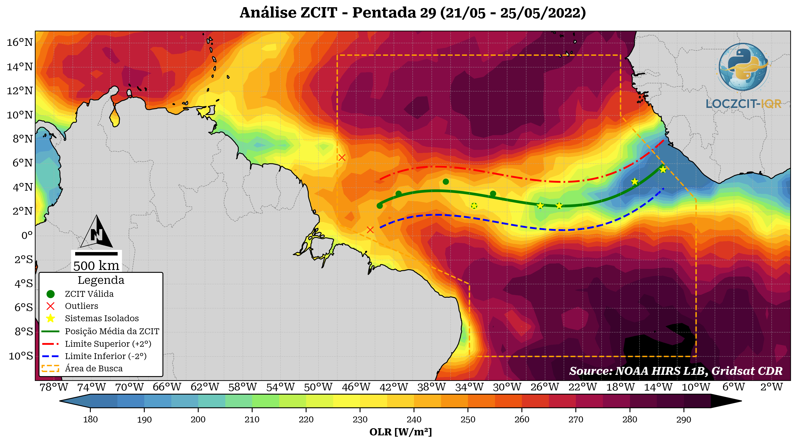

<div align="center">

<div align="center">
  
</div>

# LOCZCIT-IQR

### **LOCalização da Zona de Convergência InterTropical - Interquartile Range**

<div align="center">
  
</div>

[](https://www.python.org/downloads/)
[](LICENSE)
[]()

*Biblioteca Python para identificação e análise da posição da Zona de Convergência Intertropical (ZCIT) utilizando métodos numéricos e estatísticos avançados*

[Características](#características) • [Instalação](#instalação) • [Uso Rápido](#uso-rápido) • [Documentação](#documentação) • [Autores](#autores)

</div>

---

## 📋 Sobre o Projeto

**LOCZCIT-IQR** é uma biblioteca científica desenvolvida para automatizar a identificação e análise da **Zona de Convergência Intertropical (ZCIT)** no Atlântico Tropical. A metodologia combina técnicas estatísticas robustas (Intervalo Interquartílico - IQR) com interpolação por splines, proporcionando alta precisão na localização do eixo central da ZCIT.

### 🎯 O Problema

A ZCIT é um dos principais sistemas meteorológicos que influenciam o regime de chuvas no Brasil, especialmente nas regiões Norte e Nordeste. Sua identificação manual é trabalhosa e suscetível a inconsistências. Esta biblioteca automatiza todo o processo, garantindo:

- ✅ **Objetividade** na identificação da ZCIT
- ✅ **Reprodutibilidade** dos resultados científicos
- ✅ **Eficiência** no processamento de grandes volumes de dados
- ✅ **Detecção automática** de outliers (sistemas convectivos isolados)
- ✅ **Interpolação suave** para visualização e análise contínua

---

## ⚡ Características

### 🔬 Módulos Principais

#### **Core** (Núcleo da Biblioteca)

- **`data_loader`**: Download e carregamento automático de dados OLR da NOAA
  - Sistema de cache inteligente
  - Suporte a períodos customizados
  - Tratamento de anos bissextos
  
- **`processor`**: Processamento avançado de dados meteorológicos
  - Criação automática de pentadas (períodos de 5 dias)
  - Mascaramento geográfico flexível
  - Processamento paralelo com Dask
  - Identificação de mínimos de radiação

- **`iqr_detector`**: Detecção estatística de outliers
  - Método Interquartílico (IQR) robusto
  - Separação automática entre ZCIT e sistemas convectivos isolados
  - Análise de qualidade dos dados

- **`spline_interpolator`**: Interpolação matemática avançada
  - Múltiplos métodos: B-spline, PCHIP, Akima, Cúbica, Linear
  - Controle de suavização adaptativo
  - Validação de qualidade da interpolação
  - Detecção de curvaturas anômalas

#### **Plotting** (Visualização)

- **`visualizer`**: Geração de mapas profissionais
  - Templates prontos para publicação científica, apresentações e web
  - Paletas de cores customizáveis
  - Integração com Cartopy para contexto geográfico
  - Exportação em alta resolução

---

## 🚀 Instalação

### Pré-requisitos

- Python 3.13.5 (ou Python 3.12+)
- pip ou **UV** (recomendado - gerenciador ultra-rápido)
- Sistema operacional: Windows, Linux ou macOS

> 💡 **Dica**: O projeto foi desenvolvido e testado com Python 3.13.5, mas é compatível com versões 3.9 ou superior.

### Instalação Recomendada (UV - Rápido e Moderno)

```bash
# Instalar UV (gerenciador de pacotes Python ultra-rápido)
pip install uv

# Clonar o repositório
git clone https://github.com/seu-usuario/loczcit-iqr.git
cd loczcit-iqr

# Criar ambiente virtual com UV
uv venv

# Ativar o ambiente virtual
# Windows:
.venv\Scripts\activate
# Linux/Mac:
source .venv/bin/activate

# Instalar o pacote e todas as dependências
uv pip install -e .
```

### Instalação via pip (Tradicional)

```bash
# Clonar o repositório
git clone https://github.com/ElivaldoRocha/loczcit-iqr.git
cd loczcit-iqr

# Criar ambiente virtual
python -m venv .venv
source .venv/bin/activate  # Linux/Mac
# ou
.venv\Scripts\activate     # Windows

# Instalar em modo desenvolvimento
pip install -e .
```

### Instalação Rápida de Dependências

Se você já tem um ambiente virtual ativo, pode instalar apenas as dependências principais:

```bash
# Usando UV (recomendado - muito mais rápido!)
uv pip install numpy xarray scipy matplotlib cartopy pandas \
               geopandas dask regionmask netcdf4 shapely

# Usando pip tradicional
pip install numpy xarray scipy matplotlib cartopy pandas \
            geopandas dask regionmask netcdf4 shapely
```

**Nota**: O comando `uv pip install -e .` já instala todas as dependências automaticamente baseado no arquivo `pyproject.toml`.

### Verificar Instalação

Após a instalação, verifique se tudo está funcionando corretamente:

```bash
# No terminal Python ou notebook
python -c "import loczcit_iqr as lz; lz.check_modules()"
```

Você deve ver uma saída indicando que todos os módulos core estão disponíveis:

```
✓ LOCZCIT-IQR - Status dos Módulos
==================================================
✓ CORE:
  ✓ data_loader
  ✓ processor
  ✓ iqr_detector
  ✓ spline_interpolator

✓ PLOTTING:
  ✓ visualizer

✓ UTILS:
  ✓ pentadas
```

### Dependências Principais

**Core (Obrigatórias):**
- `numpy` == 2.3.3 (Computação numérica)
- `xarray` == 2025.9.0 (Manipulação de arrays multidimensionais)
- `scipy` == 1.16.2 (Algoritmos científicos e interpolação)
- `matplotlib` == 3.10.6 (Visualização de dados)
- `cartopy` == 0.25.0 (Mapas e projeções cartográficas)
- `pandas` == 2.3.2 (Análise de dados tabulares)
- `shapely` == 2.1.2 (Operações geométricas)
- `netcdf4` == 1.7.2 (Leitura de arquivos NetCDF)
- `pyarrow` == 21.0.0 (Leitura de arquivos Parquet)

**Processamento e Análise:**
- `geopandas` == 1.1.1 (Dados geoespaciais)
- `regionmask` == 0.13.0 (Máscaras geográficas otimizadas)
- `dask` == 2025.9.1 (Processamento paralelo)
- `h5netcdf` == 1.6.4 (Backend alternativo para NetCDF)
- `cftime` == 1.6.4.post1 (Manipulação de calendários)

**Visualização Avançada:**
- `seaborn` == 0.13.2 (Visualizações estatísticas)
- `matplotlib-scalebar` == 0.9.0 (Barras de escala em mapas)
- `imageio` == 2.37.0 (Manipulação de imagens)
- `pillow` == 11.3.0 (Processamento de imagens)

**Georreferenciamento:**
- `rasterio` == 1.4.3 (Dados raster)
- `pyproj` == 3.7.2 (Transformações de coordenadas)
- `pyogrio` == 0.11.1 (I/O geoespacial rápido)
- `geopy` == 2.4.1 (Geocodificação)

---

## 💡 Uso Rápido

### Exemplo Básico

```python
import loczcit_iqr as lz
import matplotlib.pyplot as plt

# --- 1. Configuração e Carregamento ---

# Importa todas as classes e funções necessárias
from loczcit_iqr.core.data_loader import NOAADataLoader
from loczcit_iqr.core.processor import DataProcessor
from loczcit_iqr.core.iqr_detector import IQRDetector
from loczcit_iqr.core.spline_interpolator import SplineInterpolator, SplineParameters, InterpolationMethod
from loczcit_iqr.plotting.visualizer import ZCITVisualizer
from loczcit_iqr.utils import pentada_to_dates

# Define o ano e a pêntada para a análise
ANO_ALVO = 2022
PENTADA_ALVO = 29

# Carrega os dados de OLR para o ano inteiro
print(f"Carregando dados de OLR para {ANO_ALVO}...")
loader = NOAADataLoader()
olr_data = loader.load_data(start_date=f"{ANO_ALVO}-01-01", end_date=f"{ANO_ALVO}-12-31")

# Cria as 73 pêntadas para o ano
print("Processando dados em pêntadas...")
processor = DataProcessor()
pentads_year = processor.create_pentads(olr_data=olr_data, year=ANO_ALVO)

# --- 2. Análise Detalhada da ZCIT ---

print(f"Iniciando análise para a pêntada {PENTADA_ALVO}...")

# Seleciona os dados 2D da pêntada de interesse
olr_pentada = pentads_year['olr'].sel(pentada=PENTADA_ALVO)

# Encontra os pontos principais da ZCIT (mínimos por coluna)
min_coords = processor.find_minimum_coordinates(
    olr_pentada,
    method='column_minimum'
)

# Detecta outliers com o método IQR
detector = IQRDetector(constant=0.75)
coords_validos, coords_outliers, _ = detector.detect_outliers(min_coords)

# Encontra outros sistemas convectivos isolados (mínimos locais)
sistemas_convectivos = processor.find_minimum_coordinates(
    olr_pentada,
    threshold=230,
    method='local_minimum'
)

# Configura os parâmetros para a interpolação B-spline
params_bspline = SplineParameters(
    method=InterpolationMethod.BSPLINE,
    smooth_factor='high',
    degree=3,
    num_points_output=100
)

# Interpola a linha da ZCIT usando apenas os pontos válidos
interpolator = SplineInterpolator()
zcit_line, _ = interpolator.interpolate(coords_validos, parameters=params_bspline)

# --- 3. Visualização Completa ---

print("Gerando visualização completa...")

# Cria um título dinâmico com o período exato da pêntada
start_date, end_date = pentada_to_dates(PENTADA_ALVO, ANO_ALVO)
titulo_customizado = (
    f"Análise ZCIT - Pentada {PENTADA_ALVO} "
    f"({start_date.strftime('%d/%m')} - {end_date.strftime('%d/%m/%Y')})"
)

# Inicializa o visualizador com um template profissional
viz = ZCITVisualizer(template='publication')

# Plota a análise completa com todos os elementos
fig, ax = viz.plot_complete_analysis(
    olr_data=olr_pentada,
    title=titulo_customizado,
    coords_valid=coords_validos,
    coords_outliers=coords_outliers,
    sistemas_convectivos=sistemas_convectivos,
    zcit_line=zcit_line,
    study_area_visible=True
)

plt.show()
```

### Monitoramento Pelo Último Período Disponível no Servidor da NOAA: últimos 5 dias no dataset.
```python
import pandas as pd
import os

from loczcit_iqr.core.data_loader import NOAADataLoader
from loczcit_iqr.core.processor import DataProcessor
from loczcit_iqr.core.iqr_detector import IQRDetector
from loczcit_iqr.core.spline_interpolator import SplineInterpolator, SplineParameters, InterpolationMethod
from loczcit_iqr.plotting.visualizer import *

# =============================================================================
# 1. CARREGAMENTO E PROCESSAMENTO
# =============================================================================
ano = 2025
loader = NOAADataLoader()
processor = DataProcessor()
print(f"Carregando dados diários para {ano}...")
olr_data = loader.load_data(start_date=f"{ano}-01-01", end_date=f"{ano}-12-31")
print("\nCalculando a média de OLR para o período mais recente...")
olr_recente = processor.process_latest_period(olr_data, num_days=5)
print("Média recente calculada com sucesso.")

# =============================================================================
# 2. ANÁLISE DA ZCIT
# =============================================================================
print(f"\nIniciando análise para o período recente...")
detector = IQRDetector()
interpolator = SplineInterpolator()
min_coords = processor.find_minimum_coordinates(
    data_array=olr_recente, method='column_minimum', search_radius=1
)
coords_valid, coords_outliers, resumo = detector.detect_outliers(min_coords)
sistemas_convectivos = processor.find_minimum_coordinates(
    data_array=olr_recente, threshold=230, method='local_minimum', search_radius=2
)
params_bspline = SplineParameters(
    method=InterpolationMethod.BSPLINE, smooth_factor='high', degree=3, 
    num_points_output=100, extrapolate_flag=True, reference_latitude=0
)
zcit_line, _ = interpolator.interpolate(coords_valid, parameters=params_bspline)
print("Análise concluída.")

# =============================================================================
# 3. VISUALIZAÇÃO
# =============================================================================

# --- Preparar o título ---
start_str = olr_recente.attrs['period_start']
end_str = olr_recente.attrs['period_end']
start_date_title = pd.to_datetime(start_str)
end_date_title = pd.to_datetime(end_str)
titulo_customizado = (
    f"Análise ZCIT - Média de 5 dias "
    f"({start_date_title.strftime('%d/%m')} - {end_date_title.strftime('%d/%m/%Y')})"
)

# --- Chamar o método "mestre" ---
viz = ZCITVisualizer(template='publication')
fig, ax = viz.plot_complete_analysis(
    olr_data=olr_recente,
    title=titulo_customizado,
    coords_valid=coords_valid,
    coords_outliers=coords_outliers,
    sistemas_convectivos=sistemas_convectivos,
    zcit_line=zcit_line,
    study_area_visible=True,
    save_path=None # ou 'minha_figura.png' para salvar
)

# --- Mostrar o Gráfico ---
plt.show()

```

### Análise Climatológica
⚠️ Ainda não utilizar o módulo de climatologia, ainda em desenvolvimento ⚠️
```python
from loczcit_iqr.utils.climatologia import (
    climatologia_nordeste_brasileiro,
    comparar_com_climatologia_cientifica
)

# Calcular climatologia para o Nordeste (1992-2021)
clima = climatologia_nordeste_brasileiro(
    anos_amostra=range(1992, 2022)
)

# Comparar posição observada com climatologia
status, desvio, interpretacao = comparar_com_climatologia_cientifica(
    mes=3,
    posicao_encontrada=-2.5
)

print(f"Status: {status}")
print(f"Desvio: {desvio:.2f}°")
print(f"Interpretação: {interpretacao}")
```

---

## 📚 Metodologia

A metodologia LOCZCIT-IQR segue um fluxo de trabalho robusto e validado cientificamente:

### 1️⃣ **Identificação de Coordenadas**
Localização das coordenadas que marcam a máxima atuação da convecção (mínimos de ROL/OLR)

### 2️⃣ **Armazenamento**
Guardar coordenadas em estrutura de dados otimizada

### 3️⃣ **Detecção de Outliers** (IQR)
Análise estatística para identificar sistemas convectivos isolados usando o método do Intervalo Interquartílico

### 4️⃣ **Interpolação**
Aplicação de splines (B-spline, PCHIP, etc.) com controle de suavização para gerar linha contínua da ZCIT

### 5️⃣ **Exportação**
Geração do eixo central da ZCIT com metadados e estatísticas de qualidade

---

## 🗂️ Estrutura do Projeto

```
loczcit-iqr/
│
├── src/
│   ├── loczcit_iqr/
│   │   ├── __init__.py
│   │   ├── core/
│   │   │   ├── data_loader.py       # Download e carregamento de dados
│   │   │   ├── processor.py         # Processamento de pentadas
│   │   │   ├── iqr_detector.py      # Detecção de outliers
│   │   │   └── spline_interpolator.py  # Interpolação matemática
│   │   │
│   │   ├── plotting/
│   │   │   └── visualizer.py        # Visualização e mapas
│   │   │
│   │   └── utils/
│   │       ├── pentadas.py      # Conversão e manipulação de pentadas
│   │       └── validators.py    # Funções de validação 
│   │
│   ├── data/
│   │   └── shapefiles/              # Arquivos de área de estudo
│   │
│   └── assets/
│       └── img/
│           └── logo_Oficial.png     # Logo do projeto
│
├── notebooks/                        # Exemplos de uso
├── docs/                             # TCC e Documentação completa
├── README.md
├── LICENSE
└── setup.py
```

---

## 📖 Documentação

### Guia de Início Rápido

```python
import loczcit_iqr as lz

# Ver guia interativo
lz.quick_start_guide()

# Verificar módulos disponíveis
lz.check_modules()
```

### Documentação Completa

Acesse a documentação completa em: [https://loczcit-iqr.readthedocs.io](https://loczcit-iqr.readthedocs.io) *(em breve)*

### Notebooks de Exemplo

Explore os notebooks Jupyter na pasta `notebooks/`:
- `data_loader.ipynb` - Carregamento de dados NOAA
- `processor_and_Interpolator.ipynb` - Processamento de pentadas, Detecção de outliers e Interpolação avançada
- `work_flow.ipynb` - Exemplo sugerido de fluxo de trabalho

---

## 🔬 Fundamentação Científica

Esta biblioteca foi desenvolvida com base em métodos consolidados na literatura científica:

### Referências Principais

- **Waliser & Gautier (1993)** - *Journal of Climate*
  - Métodos de identificação da ZCIT
  
- **Xie & Philander (1994)** - *Journal of Climate*
  - Dinâmica oceano-atmosfera da ZCIT

- **Ferreira et al. (2005)** - *Revista Brasileira de Meteorologia*
  - Metodologia LOCZCIT original
  
- **Cavalcanti et al. (2009)** - *Tempo e Clima no Brasil*
  - Climatologia da ZCIT sobre o Brasil

- **NOAA Climate Data Record (1979-2023)**
  - Dados de Radiação de Onda Longa (OLR)

### Dados Utilizados

- **Fonte**: NOAA Interpolated Outgoing Longwave Radiation (OLR)
- **Resolução espacial**: 2.5° × 2.5° (latitude × longitude)
- **Resolução temporal**: Diária
- **Cobertura**: Global, 1979 - presente
- **Formato**: NetCDF4

---

## 👥 Autores

### Desenvolvedor e Autor

**Elivaldo Carvalho Rocha**
- 📧 Email: carvalhovaldo09@gmail.com
- 🎓 Meteorologista - Universidade Federal do Pará (UFPA)
- 📅 Data da defesa: 29/12/2022
- 🔗 [GitHub](https://github.com/ElivaldoRocha) | [LinkedIn](https://www.linkedin.com/in/elivaldo-rocha-10509b116/)

### Orientação Científica

**Prof. Dr. Everaldo Barreiros de Souza** - Orientador
- 🏛️ Universidade Federal do Pará (UFPA)
- 📚 Doutor em Meteorologia

### Banca Examinadora

**Prof. Dr. José Danilo da Costa Souza Filho** - Membro interno
- 🏛️ Universidade Federal do Pará (UFPA)
- 📚 Doutor em Ciências Ambientais

**Prof. Dr. José Maria Brabo Alves** - Membro externo
- 🏛️ Universidade Estadual do Ceará (UECE)
- 📚 Doutor em Engenharia Civil – Recursos Hídricos

**Prof. Dr. Nivaldo Silveira Ferreira** - Membro externo
- 🏛️ Universidade Estadual do Norte Fluminense (UENF)
- 📚 Doutor em Meteorologia

---

## 🤝 Contribuindo

Contribuições são muito bem-vindas! Se você deseja melhorar esta biblioteca:

1. Fork o projeto
2. Crie uma branch para sua feature (`git checkout -b feature/MinhaFeature`)
3. Commit suas mudanças (`git commit -m 'Adiciona MinhaFeature'`)
4. Push para a branch (`git push origin feature/MinhaFeature`)
5. Abra um Pull Request

### Diretrizes

- Siga as convenções PEP 8 para código Python
- Adicione testes para novas funcionalidades
- Atualize a documentação conforme necessário
- Mantenha o código limpo e bem comentado

---

## 📝 Licença

Este projeto está sob a licença MIT. Veja o arquivo [LICENSE](LICENSE) para mais detalhes.

---

## 🙏 Agradecimentos

- **NOAA** pelo fornecimento dos dados de OLR
- **Comunidade Python Científico** pelas excelentes bibliotecas
- **UFPA** pelo suporte institucional
- **Projeto Original LOCZCIT** por Ferreira et al. (2005)

---

## 📞 Contato & Suporte

- 💬 **Issues**: [GitHub Issues](https://github.com/ElivaldoRocha/loczcit-iqr/issues)
- 📧 **Email**: carvalhovaldo09@gmail.com
- 📖 **Documentação**: [ReadTheDocs](https://loczcit-iqr.readthedocs.io)

---

## 📊 Status do Projeto

**Versão Atual**: 0.0.1  
**Status**: Desenvolvimento Ativo  
**Última Atualização**: Outubro 2025

---

<div align="center">

**⭐ Se este projeto foi útil para você, considere dar uma estrela no GitHub! ⭐**

Feito com ❤️ para a comunidade científica brasileira

[⬆ Voltar ao topo](#loczcit-iqr)

</div>