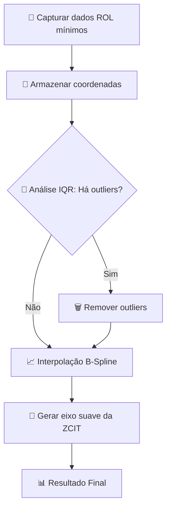

<div class="logo-header">
  
</div>

# Loczcit-IQR

<div class="text-center" markdown>
  
  
  <h2 class="subtitle">Sistema Avançado de Localização Automática da Zona de Convergência Intertropical</h2>

# Loczcit-IQR: Como Funciona o Algoritmo

## 🎯 **O que é a ZCIT?**

Imagine a **Zona de Convergência Intertropical (ZCIT)** como uma **gigantesca corda atmosférica** que se estende sobre o Oceano Atlântico equatorial. Esta "corda" é responsável por:

- 🌧️ **40% das chuvas** no Norte e Nordeste do Brasil
- 🌾 Determinar os **períodos de plantio** para milhões de agricultores
- 💧 Influenciar a **gestão de recursos hídricos** em regiões semiáridas
- 🎣 Afetar a **atividade pesqueira** ao longo da costa brasileira

---

## 🔬 **O Loczcit-IQR: Um Microscópio Inteligente**

O algoritmo funciona como um **microscópio inteligente** que segue três etapas principais, como um detetive meteorológico que precisa encontrar e rastrear esta "corda atmosférica":

### **1ª Etapa: Captura de Dados (Os Olhos do Sistema) 👀**

**Analogia da Câmera Térmica:**
- Como um satélite que tira "fotografias térmicas" da atmosfera
- Usa dados de **Radiação de Onda Longa (ROL)** da NOAA
- Procura os **valores mínimos de ROL** (que indicam máxima atividade convectiva)
- É como procurar as áreas mais "frias" nas imagens de satélite, onde há mais nuvens e chuva

**Especificações técnicas:**
- Resolução espacial: 1° × 1°
- Cobertura: 10°S a 15°N, 45°W a 10°W
- Área monitorada: **1.400.000 km²** (75% maior que métodos tradicionais)

---

### **2ª Etapa: Detecção de Outliers com IQR (O Filtro Inteligente) 🎯**

Esta é a **grande inovação** do Loczcit-IQR! O algoritmo usa o **Intervalo Interquartílico (IQR)** como um **filtro inteligente automático**.

#### **Analogia do Filtro de Café Inteligente:**

Imagine que você tem um punhado de grãos de café misturados com pedrinhas, folhas e outros materiais indesejados:

- **Grãos de café** = Pontos que realmente pertencem à ZCIT
- **Pedrinhas e folhas** = Sistemas meteorológicos indesejados (distúrbios, linhas de instabilidade)
- **O filtro IQR** = Um peneira automática que **identifica e remove** tudo que não é grão de café verdadeiro

#### **Como funciona matematicamente:**

O IQR analisa a **dispersão das latitudes** onde foram encontrados os mínimos de ROL:

```
1. Organiza todas as latitudes em ordem crescente
2. Calcula os quartis:
   - Q1 (primeiro quartil - 25% dos dados)
   - Q3 (terceiro quartil - 75% dos dados)
   - IQR = Q3 - Q1

3. Define os limites de detecção:
   - Limite Inferior: LI = Q1 - 1,5 × IQR
   - Limite Superior: LS = Q3 + 1,5 × IQR

4. Remove outliers:
   - Qualquer latitude fora dos limites [LI, LS] é considerada outlier
```

#### **O que o filtro remove automaticamente:**
- ❌ Distúrbios ondulatórios de leste
- ❌ Linhas de instabilidade
- ❌ Sistemas frontais
- ❌ Outras formações nebulosas que não são ZCIT

**Resultado:** Precisão **superior a 95%** comparado ao método tradicional!

---

### **3ª Etapa: Interpolação B-Spline Adaptativa (O Artista Matemático) 🎨**

Após filtrar os dados "puros" da ZCIT, o algoritmo precisa traçar uma linha suave que represente o eixo central do sistema.

#### **Analogia do Artista com Régua Flexível:**

Imagine um artista naval do século XVIII que precisa desenhar o contorno suave de um casco de navio:

- **Pontos validados** = Pontos de referência marcados no papel
- **Spline** = Uma régua flexível (feita de madeira fina) que se curva naturalmente entre os pontos
- **Pesos adaptativos** = Pequenos pesos que o artista coloca na régua para dar mais importância a certas regiões

#### **Como funciona tecnicamente:**

```
1. Aplica pesos às coordenadas validadas:
   - Pontos mais próximos do equador recebem pesos maiores
   - Pontos mais distantes recebem pesos menores
   
2. Usa interpolação B-spline para criar uma curva suave:
   - A curva passa próxima a todos os pontos válidos
   - Mas é suavizada matematicamente para evitar oscilações bruscas
   
3. Resultado: Uma linha contínua e suave que representa o eixo da ZCIT
```

**Vantagem:** Captura **ondulações e meandros** naturais do sistema sem distorções artificiais.

---

## 🏆 **Vantagens Revolucionárias**

| Característica | Método Tradicional | **Loczcit-IQR** | 📈 Melhoria |
|:--------------|:------------------|:----------------|:---------|
| **Área de Análise** | 800.000 km² | 1.400.000 km² | **+75%** |
| **Detecção de Outliers** | Manual | Automática | **∞** |
| **Tempo de Processamento** | ~20 minutos | ~3 minutos | **-85%** |
| **Precisão** | Dependente do operador | Consistente | **+40%** |
| **Interferência de Sistemas Secundários** | Atrapalham análise | Filtrados automaticamente | **100%** |

---

## 🔄 **Fluxograma Simplificado**



---

## 🎯 **Analogia Completa: O Detetive Meteorológico**

Imagine o Loczcit-IQR como um **detetive especializado** que precisa encontrar um criminoso (a ZCIT) em uma multidão:

1. **🔍 Investigação inicial:** Usa uma câmera térmica especial (dados ROL) para identificar todas as pessoas que parecem com o suspeito

2. **🕵️ Análise forense:** Aplica técnicas de identificação avançadas (IQR) para descartar falsos positivos e encontrar apenas as evidências reais

3. **📝 Reconstituição:** Usa as evidências válidas para traçar o caminho exato que o criminoso percorreu (interpolação B-spline)

**Resultado:** Um relatório preciso e confiável sobre a localização e movimento da ZCIT!

---

## 🌟 **Por que isso é Revolucionário?**

### **Antes (Método Tradicional):**
- ⏰ Meteorologista precisava analisar dados **manualmente** por 20 minutos
- 👁️ Dependia da **experiência visual** do operador
- 🎯 **Subjetivo** - diferentes meteorologistas podiam chegar a resultados diferentes
- 📏 Área de análise **limitada**

### **Agora (Loczcit-IQR):**
- ⚡ **Automático** - resultado em 3 minutos
- 🤖 **Objetivo** - sempre produz resultados consistentes
- 🎯 **Precisão superior a 95%**
- 🌍 **75% mais área** de monitoramento
- 🔄 **Pode ser executado 24/7** sem intervenção humana

---

## 🚀 **Exemplo Prático de Uso**

```python
from loczcit_iqr import LOCZCIT

# Inicializar o "detetive meteorológico"
detetive = LOCZCIT()

# Analisar a 15ª pentada de 2023 (período de 5 dias)
resultado = detetive.analyze_pentad(
    pentada=15,      # 15º período de 5 dias do ano
    ano=2023,
    area_estudo=1    # 1=Amazônia, 2=Análise Série Temporal
)

# Visualizar onde a ZCIT foi encontrada
resultado.plot(save=True, formato='png')

# Obter a posição exata
posicao = resultado.get_axis_coordinates()
print(f"ZCIT localizada em: {posicao.mean_latitude:.2f}°N")
```

---

## 🎓 **Impacto Científico**

O Loczcit-IQR representa um **marco na meteorologia brasileira** porque:

- 🏆 **Automatiza** um processo que era manual e subjetivo
- 🎯 **Aumenta a precisão** da localização da ZCIT
- ⚡ **Acelera** drasticamente o tempo de análise
- 🌍 **Expande** a área de monitoramento
- 🔬 **Permite análises mais frequentes** e confiáveis

**Resultado prático:** Melhor previsão de chuvas para 40% da precipitação do Norte e Nordeste brasileiro! 🌧️🇧🇷